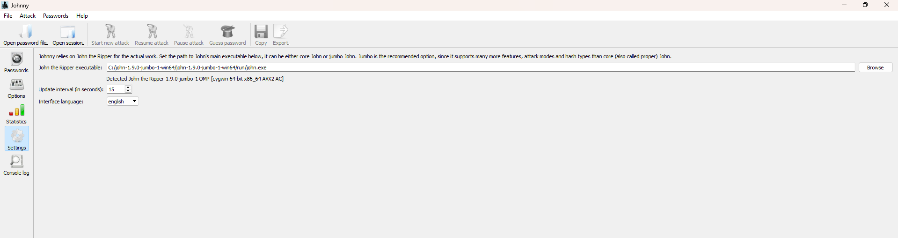
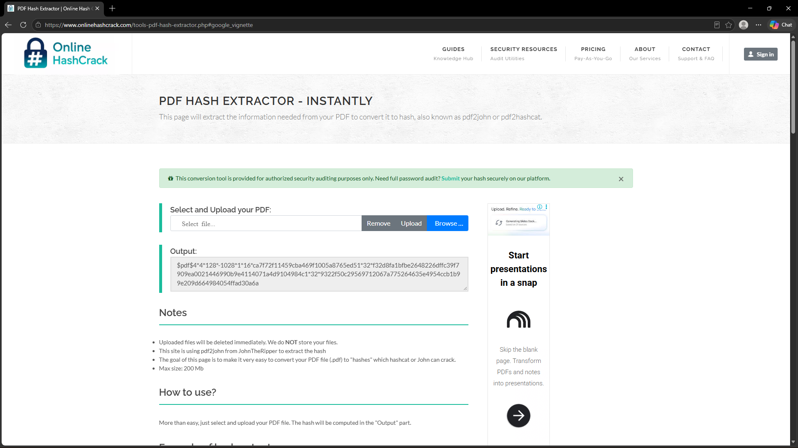
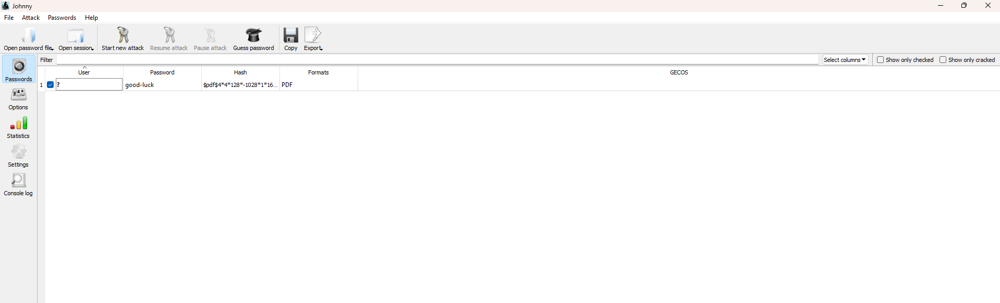
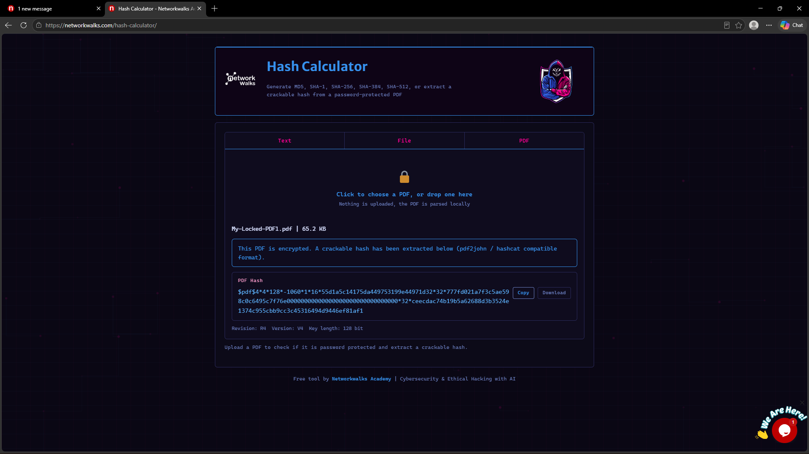
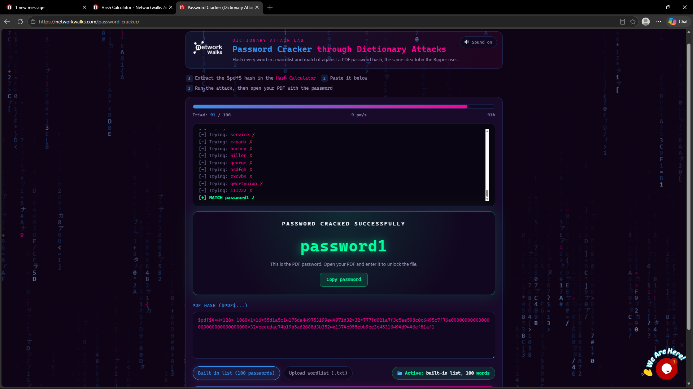
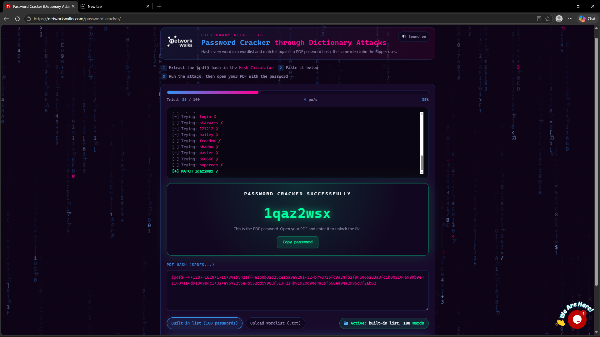

# NETWORKWALKS-B083-WK3-PASSWORD-CRACKING-REPORT


This assessment focused on password security, using tools like John the Ripper, Johnny, and Networkwalks utilities to crack and test password‑protected PDF files in a controlled lab environment.

### Password Cracking & Password Security Assessment

| Project Information | Details |
| ------------------- | ------- |
| **Author Name** | Debashree Sinha |
| **Program / Batch** | B083-Networkwalks |
| **Date** | 23 September 2026 |
| **Modules Completed** | W3-PM1 — Password Cracking with JTR |
| <br> | W3-PM2 — Password Cracking with Networkwalks Tools |
| **Target / Scope** | Password-protected PDF files provided for the Networkwalks training modules |
| **Permission Secured** | Yes — Training Lab / Provided Files |
| **Phases Covered** | Hash Extraction & Password Recovery |
| **Current Status** | Week 3 Modules Completed |

---

## Table of Contents

1. [Liability Disclaimer](#1-liability-disclaimer)
2. [Introduction](#2-introduction)
3. [Password Cracking – Basic Theory](#3-password-cracking--basic-theory)
4. [Tools Used](#4-tools-used)
5. [Activities Performed](#5-activities-performed)
   - [5.1 Module 1 – Password Cracking with John the Ripper](#51-module-1--password-cracking-with-john-the-ripper)
   - [5.2 Module 2 – Password Cracking with Networkwalks Tools](#52-module-2--password-cracking-with-networkwalks-tools)
6. [Exploration & Knowledge Gained](#6-exploration--knowledge-gained)
7. [Risk Analysis / Impact](#7-risk-analysis--impact)
8. [Recommendations](#8-recommendations)
9. [Combined Practical Results](#9-combined-practical-results)
10. [Conclusion](#10-conclusion)
11. [Evidences Collected](#11-evidences-collected)

---

# 1. Liability Disclaimer

I performed the activities documented in this report only within the authorized scope of the Networkwalks training modules, using the password-protected PDF files provided for the assigned exercises.

The purpose of these activities is cybersecurity education and practical learning. The techniques described should only be used on files, systems, or environments where appropriate authorization has been obtained.

---

# 2. Introduction

This report presents the practical work completed during **Week 3 of my cybersecurity internship at Networkwalks**, focusing on **password cracking and password security assessment**.

The first module covered **John the Ripper (JTR) and Johnny**, while the second used the **Networkwalks Hash Calculator and Password Cracker**. Both exercises involved working with password-protected PDF files and recovering their passwords through the assigned tools.

The activities provided practical exposure to how password-related information can be extracted, processed, and used for authorized password-recovery testing.

---

# 3. Password Cracking – Basic Theory

Password cracking is the process of attempting to recover a password from stored or protected data. In cybersecurity, it can be used in authorized assessments to evaluate password strength and identify weak credentials.

For a protected file, the password itself is not simply provided to the cracking tool. Instead, relevant password-related information can be extracted and processed into a format that the tool can analyze.

The training material distinguishes **hashing** from **encryption**: hashing produces a one-way representation of data, while encryption is reversible when the appropriate key is available.

For these PDF exercises, the extracted information uses a format beginning with:

```text
$pdf$...
```

A simplified workflow is:

```text
Protected PDF
      ↓
Hash Extraction
      ↓
PDF Hash ($pdf$...)
      ↓
Password Cracking
      ↓
Recovered Password
      ↓
PDF Verification
```

Password complexity affects the difficulty and time required for systematic password recovery.

---

# 4. Tools Used

| Tool / Platform | Purpose |
| --------------- | ------- |
| **John the Ripper (JTR)** | Password-cracking tool used with the extracted PDF hash. |
| **Johnny GUI** | Graphical interface for John the Ripper. |
| **Networkwalks Hash Calculator** | Extracted the hash from a protected PDF. |
| **Networkwalks Password Cracker** | Attempted password recovery from the extracted hash. |
| **Windows PC** | Primary environment for the practical activities. |
| **Web Browser** | Used for the Networkwalks online tools. |
| **Text Editor** | Used to save the extracted hash for JTR. |

John the Ripper and Johnny are introduced in the first module, while the second module uses the two browser-based Networkwalks tools. 

---

# 5. Activities Performed

## 5.1 Module 1 – Password Cracking with John the Ripper

### Objective

To recover the password of a provided protected PDF using **John the Ripper and Johnny**.

### Activities

**1. JTR / Johnny Setup**

John the Ripper and Johnny were prepared on the Windows environment, with Johnny configured to use the `john.exe` executable.

**2. PDF Hash Extraction**

The provided encrypted PDF was processed to obtain its password-related hash.

**3. Hash Preparation**

The extracted hash was copied into a text file while retaining the required `$pdf$...` format.

**4. Password Cracking**

The hash file was loaded into Johnny and a new attack was started. JTR attempted possible passwords until a matching password was recovered.

**5. Verification**

The recovered password was entered into the PDF and successfully opened the protected file.

---

## 5.2 Module 2 – Password Cracking with Networkwalks Tools

### Objective

To understand the same password-recovery process using the browser-based **Networkwalks Hash Calculator and Password Cracker**.

### Activities

**1. Hash Extraction**

The provided protected PDF was uploaded to the Networkwalks Hash Calculator, which generated the required `$pdf$...` hash.

**2. Password Cracking**

The extracted hash was submitted to the Networkwalks Password Cracker, which attempted different password possibilities.

**3. Verification**

The recovered password was entered into the protected PDF, successfully unlocking the file.

---

# 6. Exploration & Knowledge Gained

The practical work helped connect the theoretical concept of password security with an actual password-recovery workflow.

### Key Learning Points

- Understanding the purpose of password-cracking techniques in security testing.
- Understanding the role of hashes in password recovery.
- Working with the `$pdf$` hash format.
- Extracting and preparing a PDF hash.
- Using both graphical and browser-based cracking tools.
- Understanding how password complexity affects recovery difficulty.
- Verifying recovered passwords against the original protected files.

The two modules also showed that different tools can follow the same underlying process while providing different interfaces and workflows.

---

# 7. Risk Analysis / Impact

The exercises demonstrated several security implications associated with weak or predictable passwords.

| # | Risk / Finding | Observation | Potential Impact | Risk Level |
|---|----------------|-------------|------------------|------------|
| 1 | **Weak passwords** | Simple or predictable passwords can be easier to recover. | Unauthorized access to protected files. | **High** |
| 2 | **Password-related data exposure** | Protected-file data can be processed to obtain information for cracking attempts. | Enables offline password-recovery attempts. | **Medium** |
| 3 | **Short passwords** | A smaller password search space can reduce cracking difficulty. | Faster password recovery. | **High** |
| 4 | **Password reuse** | The same password may protect multiple resources. | One recovered password could expose additional resources. | **High** |
| 5 | **Password protection alone** | A password does not guarantee strong protection if the credential is weak. | Sensitive documents may become accessible. | **Medium** |

These observations relate to the training exercise and should not be interpreted as confirmed vulnerabilities in a production environment.

---

# 8. Recommendations

### 1. Use Strong, Unique Passwords
Use sufficiently long and unpredictable passwords for protected files and accounts.

### 2. Avoid Common Passwords
Avoid easily guessed words, patterns, and commonly used credentials.

### 3. Avoid Password Reuse
Use different passwords across important accounts and protected resources.

### 4. Protect Sensitive Files Appropriately
Use suitable encryption and access-control mechanisms when handling sensitive information.

### 5. Perform Authorized Password Assessments
Organizations can use password-cracking tools in controlled environments to identify weak credentials.

### 6. Restrict Access to Password-Related Data
Sensitive files and password-related information should only be accessible to authorized users.

---

# 9. Combined Practical Results

Both Week 3 modules were successfully completed.

During the practical work, I successfully recovered the passwords of **3 password-protected PDF files provided as part of the Networkwalks training exercises**.

| Module | Primary Tools | Result |
| ------- | -------------- | ------ |
| **W3-PM1** | John the Ripper + Johnny | ✅ Password successfully recovered |
| **W3-PM2** | Networkwalks Hash Calculator + Password Cracker | ✅ Passwords successfully recovered |
| **Combined Work** | Both approaches | ✅ 3 provided PDFs successfully unlocked |

This confirmed successful completion of the assigned practical exercises.

---

# 10. Conclusion

Week 3 provided hands-on experience with **password cracking and password security assessment** through two different approaches.

The JTR module introduced John the Ripper and Johnny, while the second module demonstrated the Networkwalks browser-based tools. Together, they provided practical understanding of hash extraction, password recovery, and verification.

A total of **3 provided password-protected PDFs were successfully unlocked** during the practical work.

The main takeaway was that password protection depends heavily on the strength and unpredictability of the password used. The exercises also demonstrated how authorized password-cracking techniques can be used to assess security and identify weaknesses.

---

# 11. Evidences Collected

Screenshots documenting the practical activities are included in the repository's evidence directory.

#Module 1





#Module 2





> Evidence screenshots are included in the [`evidences`](evidences/) folder.

---

## Author

### Debashree Sinha

**Cybersecurity Learner | Building Strong Foundations in Networking, Linux & Python**

---

## Project Information

| | |
|---|---|
| **Program** | Networkwalks Cybersecurity Internship |
| **Batch** | B083-Networkwalks |
| **Week** | 03 |
| **Modules** | W3-PM1 — Password Cracking with JTR |
| | W3-PM2 — Password Cracking with Networkwalks Tools |
| **Focus** | Password Cracking & Password Security Assessment |
| **Result** | 3 Provided PDFs Successfully Unlocked |

---

### Disclaimer

This repository is intended for educational and documentation purposes. The password-cracking techniques demonstrated should only be used against files, systems, or environments for which proper authorization has been obtained.
